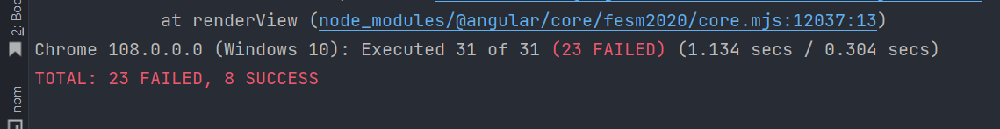
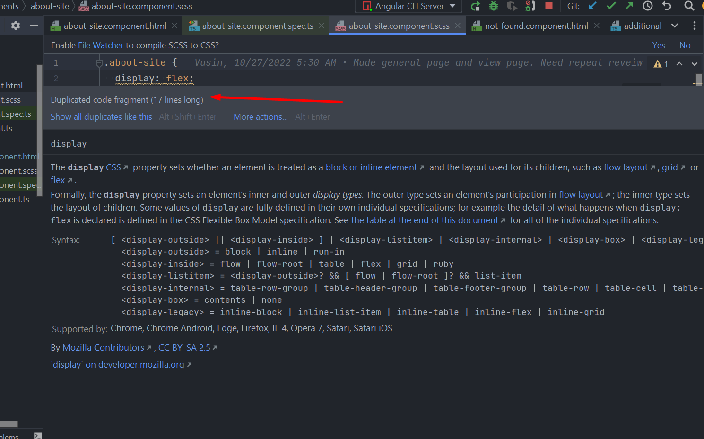

1. Добавь в readme инструкцию о запуске сервера, вдруг кто со стороны захочет посмотреть
2. Советую попробовать линтер, он поможет причесать код (покажет ненужные переносы строк, не используемые переменные и
   тп). Для этого просто напиши ng lint и дальше всё устанавливай, что предложит.
3. тесты упали 
4. ошибки в консоли 
5. Ругается на копипасту, не надо так 
6. Не стоит оставлять пустые scss файлы, конструкторы и тд и тп, это всё захламляет код, чтобы с этим было проще
   разобраться см. п2
7. Есть проблемы с названием переменных, советую посмотреть, хотя бы наш код, как называем переменные, функции и тп.
